# HRMS 关键流程图

> **范围**：7 业务流程 + 1 系统架构图 + 2 ER 图
> **关联文档**：[`HRMS-V1.2.md`](./HRMS-V1.2.md) · [API Spec](./api-spec.md)

> **使用方式**：Mermaid 语法，可在 GitHub / GitLab / VSCode Mermaid 插件 / 各类文档平台直接渲染。也可粘贴到 https://mermaid.live 在线查看。

## 一、7 个核心业务流程

### 1.1 入职流程

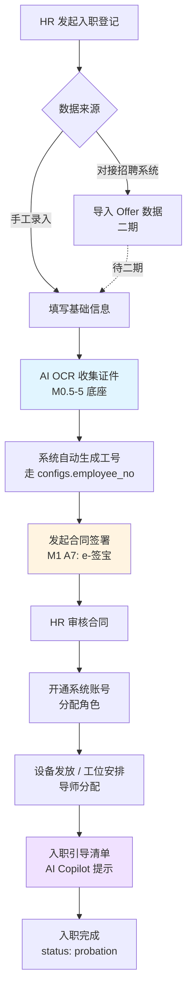

**关键节点**：
- **F**：工号生成走 `configs.employee_no.format`（配置化），规则 `{company_code}{year}{seq:4}`
- **G**：合同签署走 M0.5-1 审批流 + M1 A7 电子签
- **K**：M1 A3 阶段可叠加 AI 入职 Copilot

### 1.2 离职流程

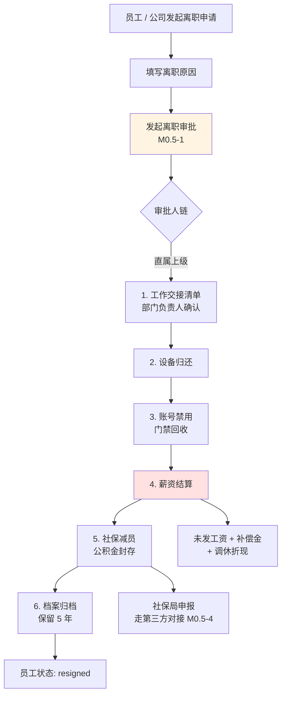

**关键节点**：
- **C**：离职审批用 M0.5-1 审批流基础设施
- **H**：薪资结算调 M4 算薪引擎
- **J**：保留 5 年走 `configs.archive.years`

### 1.3 调动流程

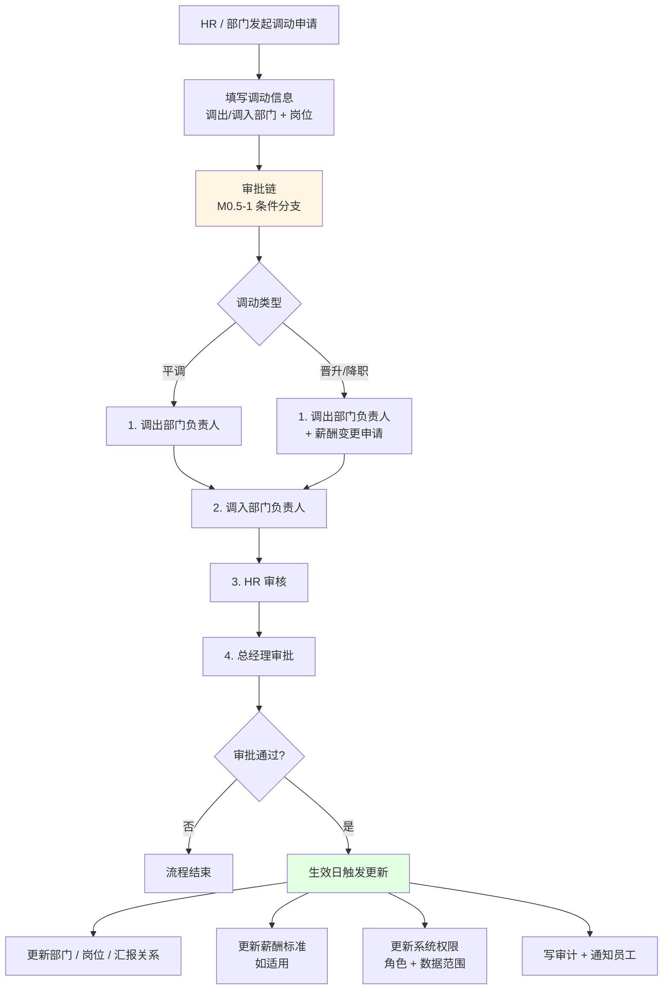

**关键节点**：
- **C**：M0.5-1 审批流模板支持条件分支（晋升/降职需多一个薪酬变更节点）
- **L**：调动生效日系统自动联动 4 项更新

### 1.4 请假流程

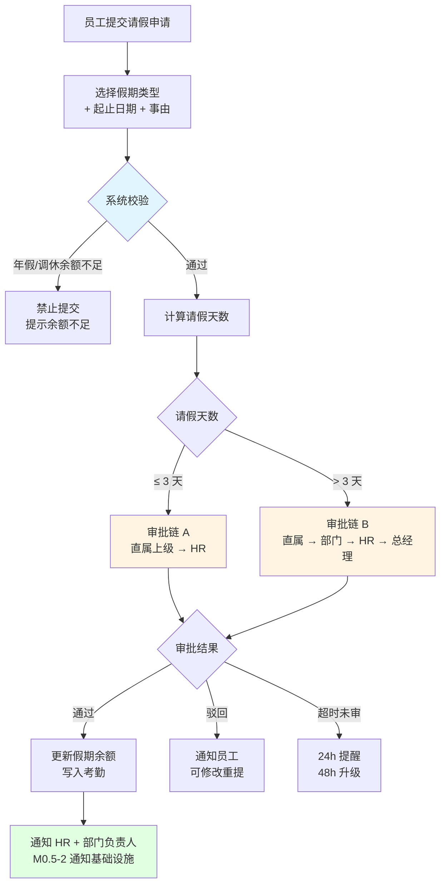

**关键节点**：
- **C**：年假/调休余额走 `configs.leave.annual_days` + `calculateLeaveBalance()`
- **G/H**：审批链分支走 M0.5-1 条件分支
- **L**：超时升级走 M0.5-2 通知基础设施

### 1.5 加班流程

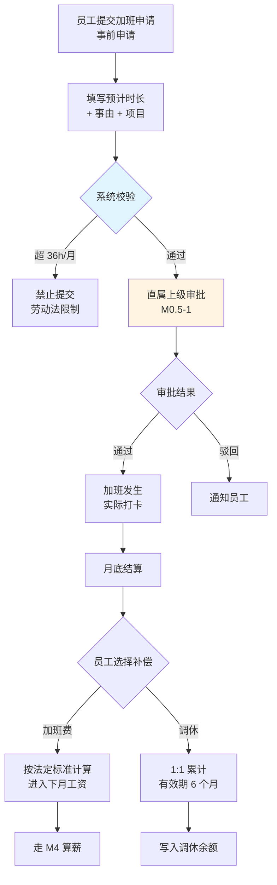

**关键节点**：
- **C**：36h 上限走 `configs.overtime.monthly_hours_cap`
- **J**：加班费/调休二选一

### 1.6 月度薪酬核算

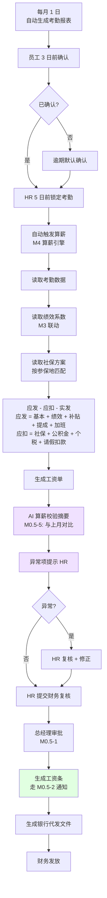

**关键节点**：
- **H**：绩效系数由 M3 月度考核结果联动
- **I**：社保方案按 `configs.social_insurance` 按城市匹配
- **L**：AI 算薪校验摘要（V1.2 新增能力）
- **R**：工资条推送走 M0.5-2 通知基础设施

### 1.7 月度绩效考核

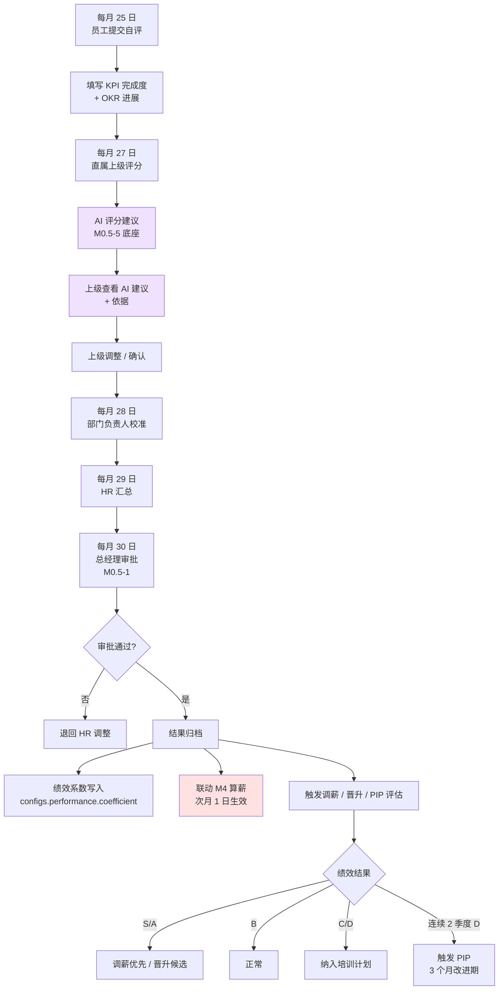

**关键节点**：
- **D/E**：AI 评分建议（V1.2 新增能力 M3 D2 切片）
- **M**：绩效系数写入 `configs.performance.coefficient` 走版本回溯
- **N**：次月 1 日自动联动 M4 算薪

## 二、系统架构图

### 2.1 HRMS 整体技术架构

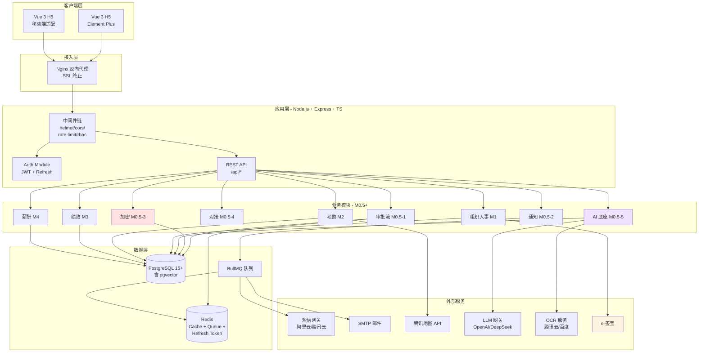

**关键说明**：
- **M0.5 公共底座层**（审批/通知/加密/对接/AI）被所有业务模块复用
- **数据层**：PostgreSQL 启用 pgvector 扩展承载 AI 嵌入
- **Redis**：同时承担缓存、队列（BullMQ）、refresh token 三种角色
- **外部服务**：通过 M0.5-4 对接框架统一管理

## 三、ER 图

### 3.1 组织架构数据模型

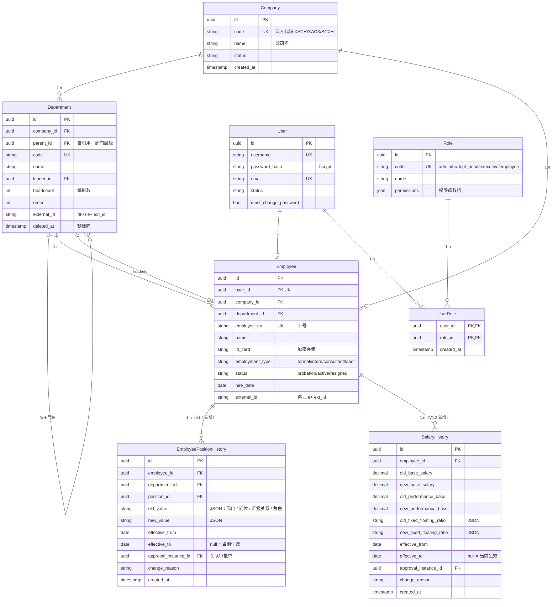

**关键设计**：
- **Department** 自引用（`parent_id`）支持 4 级层级（V1.2 §2.2.1）
- **Department.leader_id** 关联 Employee 但不强制外键（避免循环依赖）
- **Employee ↔ User** 1:1 但 User 可空（部分人员如实习初期可能未建账号）
- **external_id** 一期可空，二期对接得力 e+ 时回写

### 3.2 审批流 + 通知 + 加密 + AI 数据模型

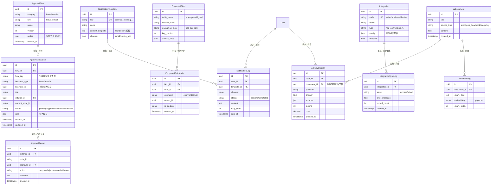

**关键设计**：
- **ApprovalFlow** 模板化，所有业务审批都复用
- **ApprovalInstance** 通过 `business_type` + `business_id` 关联到任意业务记录（请假/加班/调动/绩效/薪酬等）
- **NotificationLog** 完整记录发送状态与重试次数
- **EncryptedFieldAudit** 单独审计表（敏感字段访问必须留痕）
- **AiEmbedding** 用 pgvector 存储向量，启用 PostgreSQL 扩展
- **AiConversation** 关联 `user_id` + `document_id` 便于追溯

### 3.3 M3-D1 考核方案配置数据模型

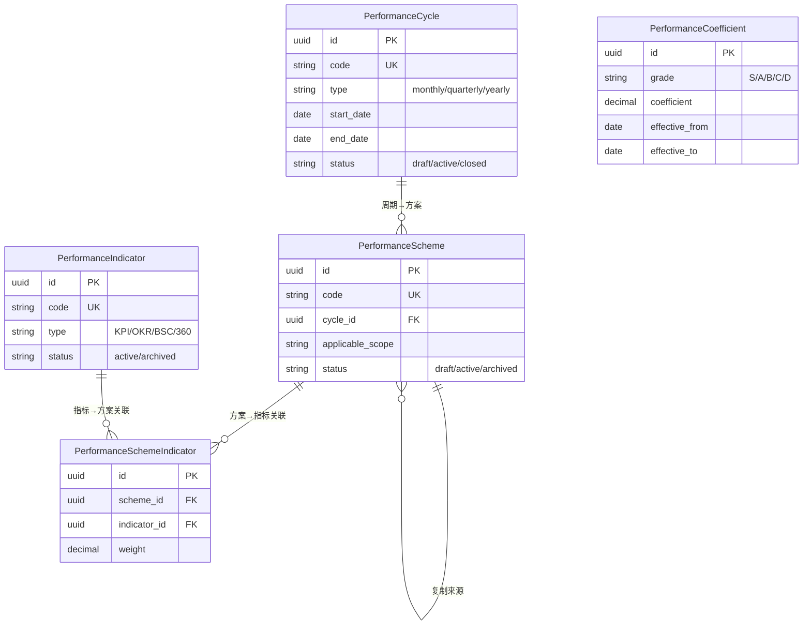

### 3.4 M3-D2 考核流程数据模型

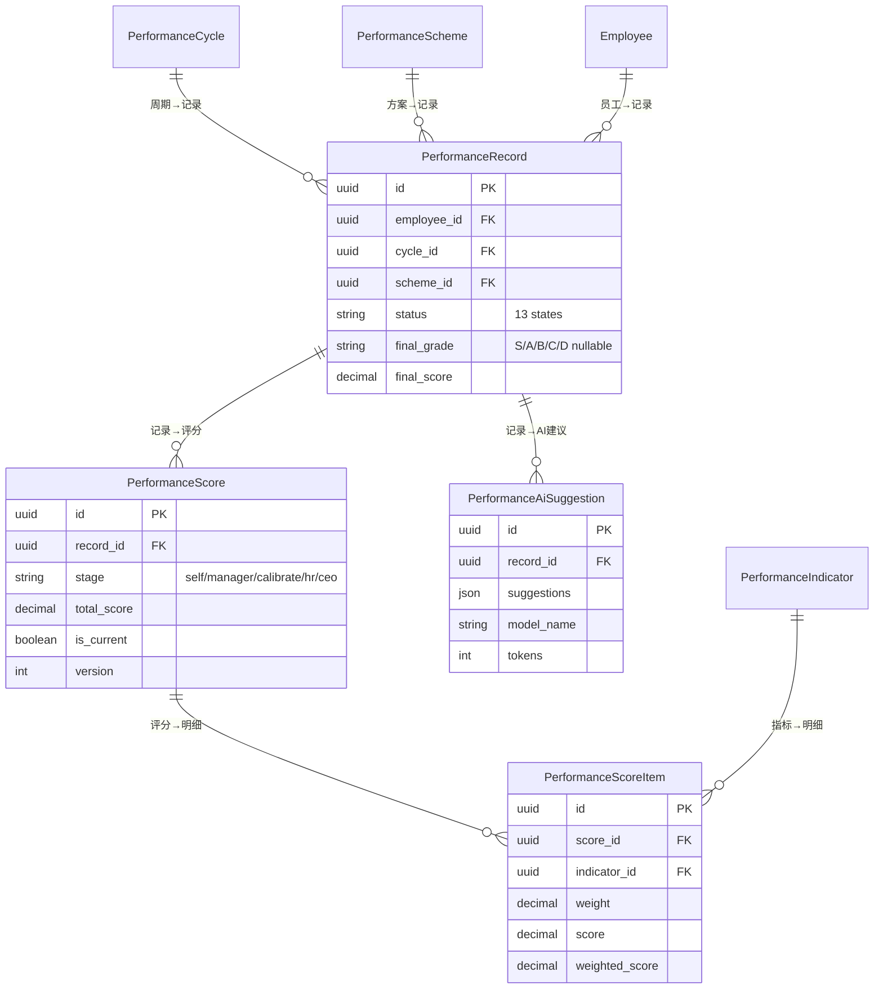

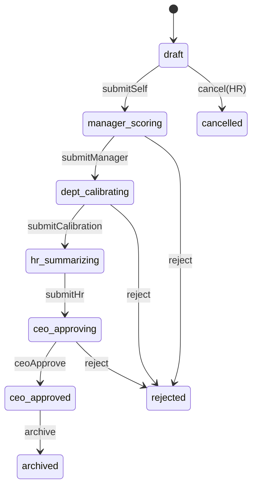

### 3.5 M3-D3 五档评分流程

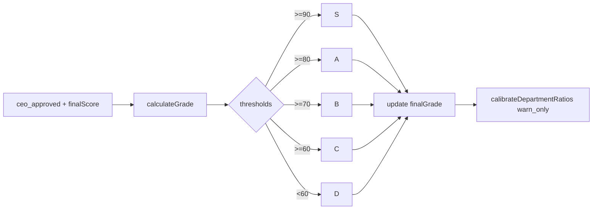

### 3.6 M3-D4 绩效兑现 ER + 双轨制流程

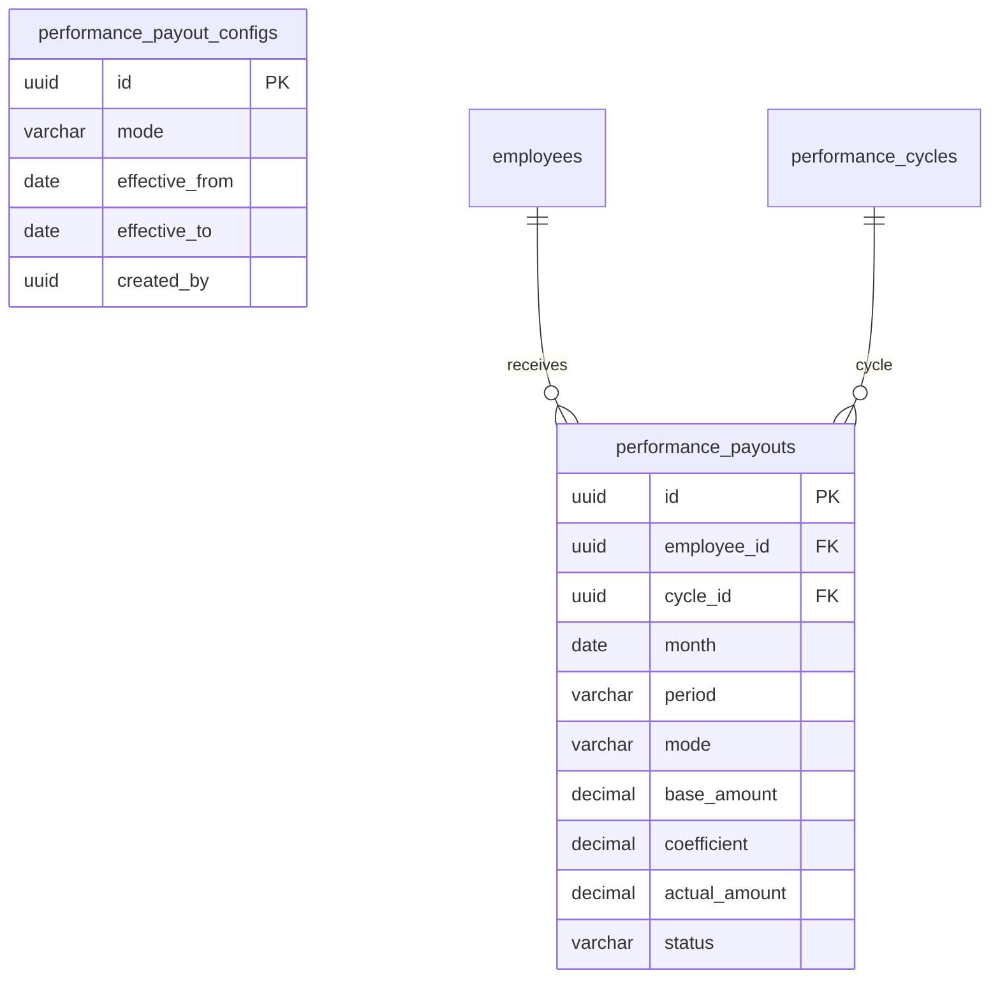

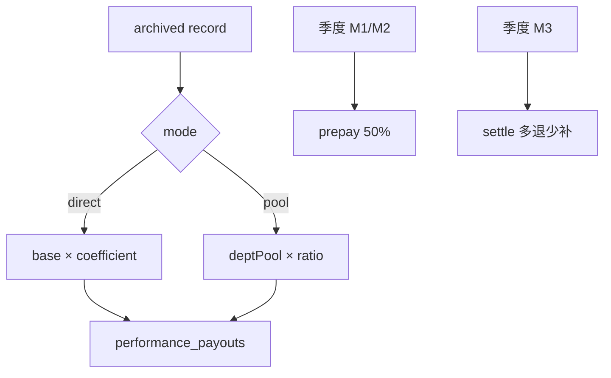

### 3.7 M3-D5 销售提成 ER + 回款触发流程

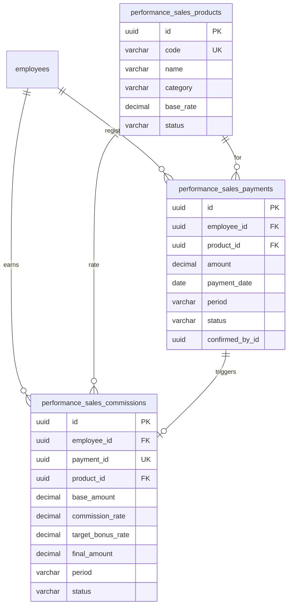

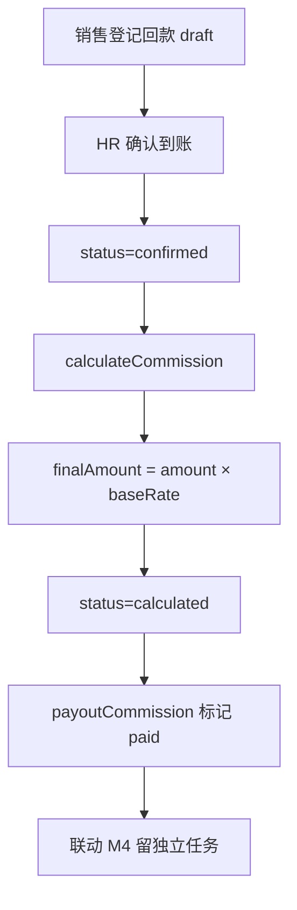

### 3.8 M3-D6 结果应用 ER + PIP 流程

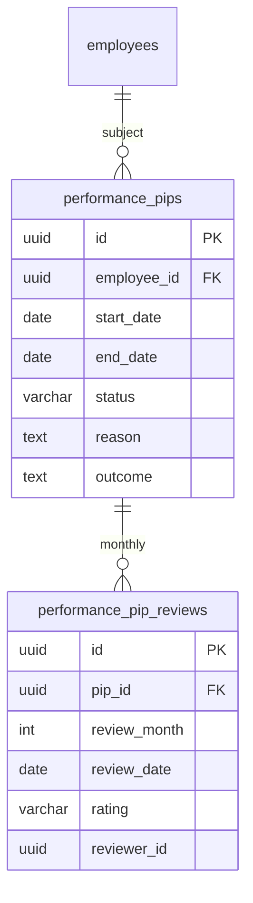

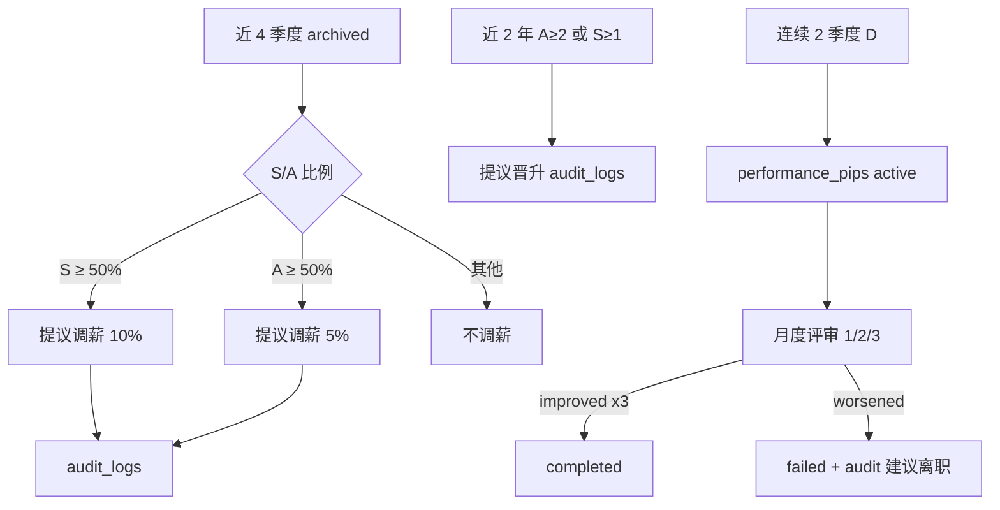

### 4.1 M4-C1 薪级薪档 + 员工薪酬方案 ER

```mermaid
erDiagram
    salary_grades {
        uuid id PK
        varchar sequence
        varchar grade_code
        varchar name
        decimal min_base_salary
        decimal max_base_salary
        decimal min_performance_base
        decimal max_performance_base
        varchar status
    }
    salary_grade_levels {
        uuid id PK
        uuid grade_id FK
        int level
        decimal base_salary
        decimal performance_base
        varchar status
    }
    employee_salary_plans {
        uuid id PK
        uuid employee_id FK
        uuid grade_id FK
        uuid level_id FK
        decimal base_salary
        decimal performance_base
        decimal allowance
        text welfare
        date effective_from
        date effective_to
        varchar status
    }
    employees ||--o{ employee_salary_plans : has
    salary_grades ||--o{ salary_grade_levels : contains
    salary_grades ||--o{ employee_salary_plans : referenced
    salary_grade_levels ||--o{ employee_salary_plans : referenced
```

```mermaid
flowchart TD
    A[定义薪级 M/T/P/S/A] --> B[每级 5-7 档递增]
    B --> C[为员工创建薪酬方案]
    C --> D[effectiveFrom 默认次月 1 日]
    D --> E[status=active]
    E --> F[C8 写入 employee_salary_history]
    F -.-> G[C1 不写 history]
```

### 4.2 M4-C2 社保公积金方案 ER

```mermaid
erDiagram
    social_insurance_schemes {
        uuid id PK
        varchar city
        varchar insurance_type
        decimal company_rate
        decimal personal_rate
        decimal base_min
        decimal base_max
        int base_adjustment_month
        varchar status
    }
    housing_fund_schemes {
        uuid id PK
        varchar city
        decimal company_rate
        decimal personal_rate
        decimal base_min
        decimal base_max
        varchar status
    }
    employee_insurance_registrations {
        uuid id PK
        uuid employee_id FK
        varchar city
        uuid social_insurance_scheme_id FK
        uuid housing_fund_scheme_id FK
        decimal base_salary
        date effective_from
        date effective_to
        varchar status
    }
    employees ||--o{ employee_insurance_registrations : registers
    social_insurance_schemes ||--o{ employee_insurance_registrations : matched
    housing_fund_schemes ||--o{ employee_insurance_registrations : matched
```

```mermaid
flowchart TD
    A[配置三地社保 5 险] --> B[配置三地公积金 5%-12%]
    B --> C[员工按参保地登记]
    C --> D[scheme.city 必须匹配]
    D --> E[status=active]
    E --> F[C3 按 baseSalary x rate 算扣]
    F -.-> G[C2 不算扣]
```

### 4.3 M4-C3 个税引擎（0 新表）

C3 为纯算法层：计算结果不落库，历史查询复用 `audit_logs`（action=`TAX_CALCULATE` / `TAX_YEAR_END_BONUS_CALCULATE` / `TAX_LABOR_INCOME_CALCULATE`）。算薪汇总与工资条持久化分别留 C4 / C5。

```mermaid
flowchart TD
    A[HR POST /salary/tax/calculate] --> B{税种}
    B -->|工资薪金| C[baseAmount - 起征点 5000]
    C --> D[7 级超额累进 + 速算扣除数]
    B -->|年终奖| E[bonusAmount / 12 找档]
    E --> F[bonusAmount x rate - 速算扣除]
    B -->|劳务报酬| G{收入是否 ≤4000}
    G -->|是| H[减 800]
    G -->|否| I[减 20%]
    H --> J[3 级 20/30/40%]
    I --> J
    D --> K[返回计算结果 + 写 audit]
    F --> K
    J --> K
    K --> L[GET /salary/tax/history 读 audit]
    L -.-> M[C5 payslips 持久化快照]
```

### 4.4 M4-C4 算薪批次 + 工资单 ER + 3 级审批

```mermaid
erDiagram
    payroll_runs ||--o{ payslips : contains
    payslips ||--o{ payslip_items : has
    employees ||--o{ payslips : receives
    payroll_runs {
        uuid id
        varchar period
        enum status
        decimal total_gross
        decimal total_net
        int anomaly_count
        boolean locked
    }
    payslips {
        uuid id
        uuid run_id
        uuid employee_id
        varchar period
        decimal gross_amount
        decimal net_amount
        enum status
    }
    payslip_items {
        uuid id
        uuid payslip_id
        enum item_type
        decimal amount
    }
```

```mermaid
flowchart TD
    A[HR 发起算薪 createPayrollRun] --> B[draft 写 payslips]
    B --> C[submit HR 提交]
    C --> D[submitted 财务复核]
    D -->|通过| E[reviewed]
    D -->|拒绝| B
    E --> F[CEO approve]
    F --> G[approved]
    G --> H[lock 锁定]
    B --> I[AI summarize 对比上月]
    I -.-> J[C5 工资条 PDF]
```

### 4.5 M4-C5 工资条 / 银企 / 个税申报 / 工资表（0 新表）

```mermaid
flowchart LR
    A[approved/locked payslip] --> B[generatePayslip HTML+mock PDF]
    B --> C[deliverPayslip]
    C --> D[M0.5-2 sendNotification]
    A --> E[banking-export icbc/ccb/cmb mock]
    A --> F[tax-declare mock 台账]
    A --> G[report-export excel/pdf mock]
```

### 4.6 M4-C6 销售提成季度结算（与 D5 联动）

```mermaid
flowchart TD
    A[D5 paid commissions 只读] --> B[4 维度汇总 employee/dept/product/report]
    A --> C[createSettlement 按财年季度汇总]
    C --> D{status}
    D -->|pending_confirm| E[hr 兼任 confirm]
    D -->|draft / pending_confirm| F[cancel]
    E --> G[confirmed 终态]
    F --> H[cancelled 终态]
    G --> I[mock 不写 payslip_items / 不联动 C4]
    B --> J[getReport mockMode true]
```

## 四、变更记录

| 版本 | 日期 | 变更说明 | 变更人 |
|---|---|---|---|
| V1.0 | 2026-08-25 | 初稿，7 业务流程 + 1 架构图 + 2 ER 图 | WorkBuddy AI |
| V1.2-C3 | 2026-08-27 | 追加 §4.3 M4-C3 个税计算流程图（0 新表，无 ER） | Cursor |
| V1.2-C4 | 2026-08-27 | 追加 §4.4 M4-C4 payroll_runs/payslips ER + 3 级审批流 | Cursor |
| V1.2-C5 | 2026-08-27 | 追加 §4.5 M4-C5 工资条/银企/个税/报表流程图（0 新表） | Cursor |
| V1.2-C6 | 2026-08-27 | 追加 §4.6 M4-C6 销售提成季度结算流程图（1 新表） | Cursor |

---

**— 文档结束 —**
